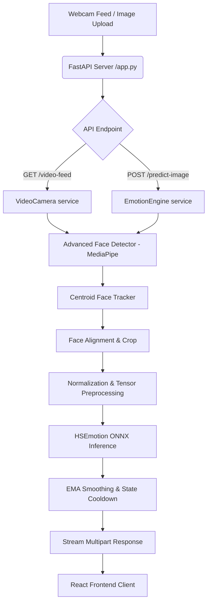

# EmotionSense AI

EmotionSense AI is a premium, real-time facial emotion recognition (FER) dashboard. It integrates state-of-the-art face detection, landmark-based face roll alignment, tracking, and prediction smoothing with a gorgeous, high-fidelity React frontend dashboard.

---

## 🚀 Features

- **Real-Time Live Tracking**: Seamless face detection and tracking using MediaPipe Face Detector.
- **Predictive Emotion Engine**: HSEmotion (EfficientNet-B0) ONNX model detects 8 emotion classes.
- **Face Roll Alignment**: Robust rotation correction utilizing eye landmarks to improve accuracy for tilted faces.
- **Signal Smoothing & State Machine**: Exponential Moving Average (EMA) smoothing and confidence lock cooldown logic prevent flickering between adjacent emotion predictions.
- **Interactive UI & Analytics**: Displays real-time confidence scores, active face count, processing frame rates, and visual timeline updates.
- **Static Image Analysis**: Support for uploading local images to predict dominant emotions and output confidence distribution charts.
- **Modular Design**: Complete separation of frontend (Vite + React) and backend (FastAPI).

---

## 🛠️ Technology Stack

### Frontend
- **Framework**: React 18+ with TypeScript
- **Styling**: Tailwind CSS
- **Routing**: TanStack Router / TanStack Start
- **Build Tool**: Vite
- **HTTP Client**: Standard native fetch referencing configurable environments

### Backend
- **Framework**: FastAPI (Python 3.12+)
- **Server**: Uvicorn
- **AI/ML Engine**: ONNX Runtime (CPU) & MediaPipe Tasks Vision
- **Computer Vision**: OpenCV (Python)
- **Data Structuring**: Pydantic v2

---

## 📐 Architecture Diagram



---

## 📁 Folder Structure

```
emotion-insight/
├── backend/
│   ├── models/                  # ONNX & TFLite model weights
│   ├── services/
│   │   ├── advanced_emotion/    # Core AI Prediction Pipeline
│   │   │   ├── config.py        # Pipeline configs (thresholds, smoothing)
│   │   │   ├── emotion_engine.py# Coordinates the entire inference loop
│   │   │   ├── emotion_model.py # ONNX model wrapper
│   │   │   ├── face_detector.py # MediaPipe face detection wrapper
│   │   │   └── preprocessing.py # ImageNet normalization & alignment
│   │   └── camera.py            # OpenCV camera capture background threads
│   ├── app.py                   # FastAPI main runner
│   ├── routes.py                # FastAPI endpoints definition
│   ├── requirements.txt         # Pinned python packages
│   └── .env.example             # Documented template for local configs
├── src/
│   ├── components/              # React components & Modals
│   ├── routes/                  # TanStack routing page components
│   ├── lib/                     # Global utilities (backend URL setup)
│   └── styles.css               # Tailored Tailwind CSS system
├── package.json                 # Frontend client configurations
├── vite.config.ts               # Vite bundler options
└── README.md                    # This document
```

---

## 📦 Installation & Setup

### 1. Prerequisite Model Weights
Ensure the following files exist in `backend/models/`:
- `emotion_hsemotion_b0.onnx` (HSEmotion ONNX model)
- `blaze_face_short_range.tflite` (MediaPipe Face Detection)
- `haarcascade_frontalface_default.xml` (Fallback face detector)

### 2. Backend Installation
Create a virtual environment and install dependencies:
```bash
cd backend
python -m venv .venv
# Activate environment
# On Windows:
.venv\Scripts\activate
# On Linux/macOS:
source .venv/bin/activate

pip install -r requirements.txt
```
Copy `.env.example` to `.env` and adjust variables if needed.

### 3. Frontend Installation
Install Node packages from the root directory:
```bash
npm install
```

---

## 🚦 Running the Application

### Start the Backend Server
```bash
# Verify virtual environment is active
python -m backend.app
```
The server will run on [http://127.0.0.1:8000](http://127.0.0.1:8000).
- Interactive Swagger docs are available at: [http://127.0.0.1:8000/docs](http://127.0.0.1:8000/docs)

### Start the Frontend Server
```bash
npm run dev
```
The client will run on [http://localhost:8080](http://localhost:8080).

---

## 📡 API Endpoints

- **`GET /health`**: Verifies backend server health.
- **`GET /settings`**: Fetches active index, confidence threshold, and box drawing preference.
- **`POST /settings`**: Updates runtime camera preferences and persists to `.env`.
- **`POST /camera/start`**: Starts the camera background frame grabbing loop.
- **`POST /camera/stop`**: Releases the webcam capture device.
- **`GET /camera-status`**: Fetches real-time tracking metrics (emotion, FPS, faces).
- **`GET /video-feed`**: Streams the annotated camera feed live using MJPEG multipart.
- **`POST /predict-image`**: Predicts emotion details from an uploaded static image.
- **`GET /camera/snapshot`**: Captures a single frame from the live video feed.

---

## ⚠️ Known Limitations

- **Webcam Lock**: Since OpenCV locks the system webcam, running multiple clients or concurrent capture loops on the same camera index may cause access failures.
- **Inference Latency**: ONNX runs on CPU by default. While extremely fast (~100-120ms per face on modern Intel/AMD chips), performance may vary on older devices.

---

## 🔮 Future Improvements

- Add GPU support (`onnxruntime-gpu`) to achieve sub-20ms multi-face inference.
- Multi-face detailed timelines and statistics.
- Exportable session logs detailing emotion transitions over time.

---

## 📄 License
This project is proprietary. All rights reserved.
